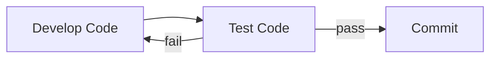
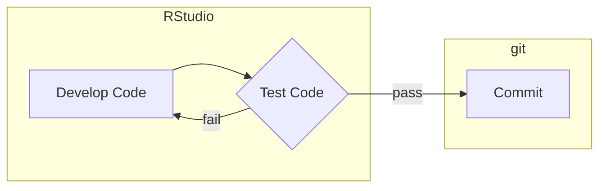

# mermaid-diagrams-tutorial
https://mermaid.js.org/syntax/flowchart.html

```mermaid
flowchart LR
  D[Develop Code]
  T[Test Code]
  C[Commit]

  D --> T
  T --pass-->C
  T --fail-->D
```

```mermaid
flowchart LR
  subgraph R [RStudio]
    D[Develop Code]
    T{Test Code}
  end
  subgraph G [git]
    C[Commit]
  end

  D --> T
  T --pass-->C
  T --fail-->D
  
```
